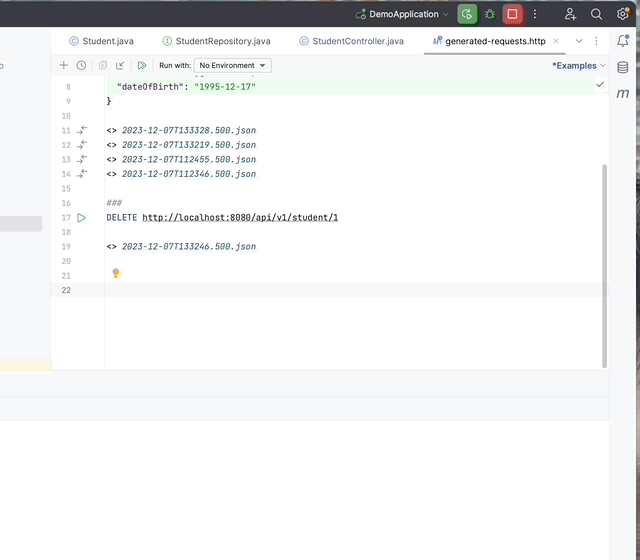

# Springboot_tutorial
 Followed the introductory tutorial by @amigoscode 

 A simple student information management system in RESTful architecture written in Java. The Springboot framework is used in this project. The application is divided into 4 layers: the API layer, the service layer, data access layer and the database. 

 ## 01: API layer 
 The application interface layer, for the users' usage. The users can send "post"(add new student), "delete"(delete student by ID) and "update"(still in progress) request by web browser. 
 The information from "post" request will be proofed by the server to make sure no duplicated student information will be recorded in the database. 
 ### Post request 
 Store a student data twice: first time success and seconde time expected error reported (id duplication check). 
  

 ## 02: Service layer 
 To provide functions in the API layer and isolate them out of security reasons.  

 ## 03: Database layer 
 Connect the software with the "student" database. 

 ## 04: Database  
 The PostgreSql is used here to store the student data. 
 
 <image src="https://github.com/luiminyan/Springboot_tutorial/blob/main/images/layers.png" height="400"> 
